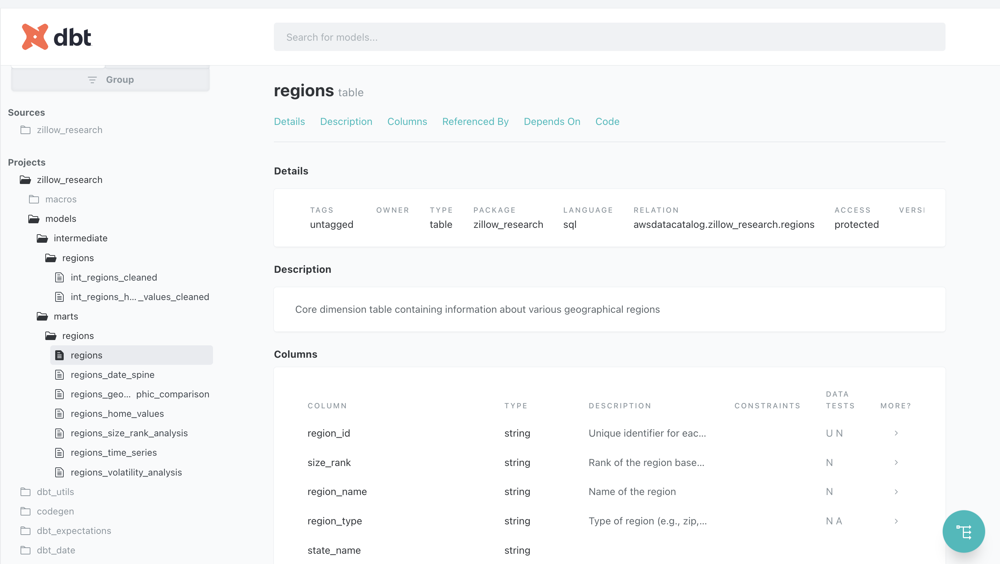
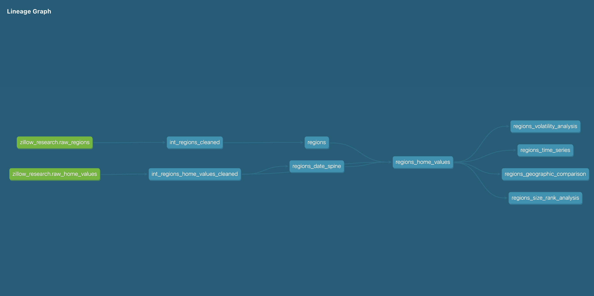

# Zillow Research dbt Project

This project uses dbt (data build tool) to transform and analyze [Zillow Research](https://www.zillow.com/research/data/) data, including home values across various regions in the United States. The project is set up to connect to AWS Athena through dbt Cloud.

## Data Source

The primary data source for this project is the Zillow Home Value Index (ZHVI):

> Zillow Home Value Index (ZHVI): A measure of the typical home value and market changes across a given region and housing type. It reflects the typical value for homes in the 35th to 65th percentile range. Available as a smoothed, seasonally adjusted measure and as a raw measure.

For more information, refer to the [ZHVI User Guide](https://www.zillow.com/research/zhvi-user-guide/).

## Project Structure

The project consists of the following main components:

1. **Source Data**: Raw data from Zillow Research, including regions and home values.
2. **Intermediate Models**: Cleaned and prepared data from the raw sources.
3. **Mart Models**: Analytics-ready models for various analyses.

### Key Models

- `regions`: Core dimension table containing information about various geographical regions.
- `regions_home_values`: Fact table containing home value data for each region over time.
- `regions_date_spine`: Date dimension table for time-based analysis.
- `regions_size_rank_analysis`: Analysis of home values and growth rates by size rank.
- `regions_volatility_analysis`: Analysis of price volatility in different regions.
- `regions_geographic_comparison`: Comparison of home values and growth rates across geographic levels.
- `regions_time_series`: Time series analysis of home values and growth rates.

## Configuration

The project is configured to use dbt Cloud with AWS Athena as the data warehouse. Key configuration details:

- **Project Name**: zillow_research
- **dbt Version**: 2.0.0
- **Profile**: zillow_research
- **Target**: AWS Athena

## dbt Cloud Docs

Here is a screenshot of the dbt Cloud docs for this project 

## Lineage Graph

The following image shows the lineage graph of the models in this project, illustrating the dependencies between different models:

## Getting Started

To get started with this project:

- Clone the repository to your local machine.
- Download Zillow Research csv files and place in the data/ directory
- run python3 scripts/compile_regions.py to create source tables for Athena
- Upload source tables to S3 to match tables in models/sources.yml
- run glue crawlers or manually create raw data tables in an athena database named zillow_research
- Set up your dbt Cloud environment with AWS Athena credentials

## Contributing

If you'd like to contribute to this project, please fork the repository and create a pull request with your changes.

## License

This project is licensed under the MIT License.
